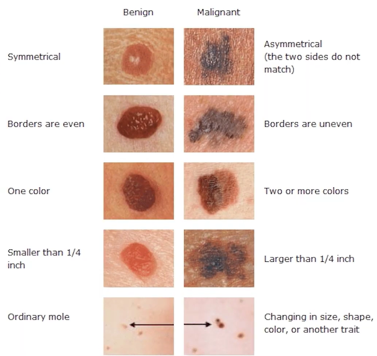

# Classify-Skin-Cancer-isic-challenge
This project is part of the ISIC Challenge for skin cancer classification. It uses deep learning with EfficientNetB3 to classify images as malignant or benign. The model is trained using TensorFlow and Keras, with data augmentation and fine-tuning techniques to improve performance.

# ISIC Challenge - Skin Cancer Classification (Beginner Project)

This repository contains a deep learning model for **skin cancer classification**, built as a beginner-friendly project for the **ISIC Challenge**. The model is trained using **TensorFlow** and **Keras**, leveraging **EfficientNetB3** for transfer learning.

### 📌 Image

## 📌 Features
- **Pretrained EfficientNetB3** for high accuracy
- **Data Augmentation** to improve generalization
- **Fine-tuning** for better performance
- **ROC Curve & AUC Metrics** for evaluation
- **Early Stopping & Learning Rate Scheduling** for optimized training

## 📂 Dataset
The dataset follows the ISIC Challenge format this is the link :
https://challenge.isic-archive.com/landing/2019/
